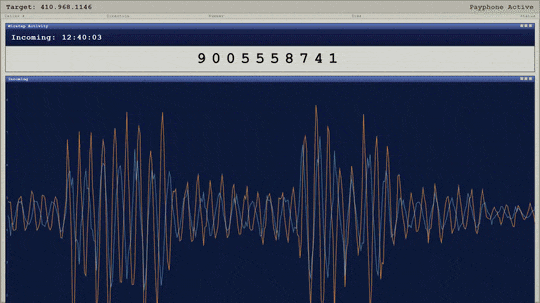
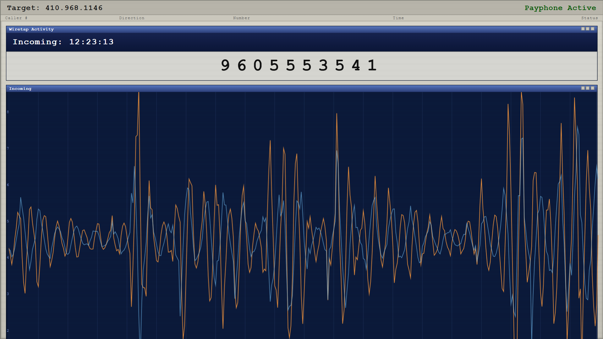
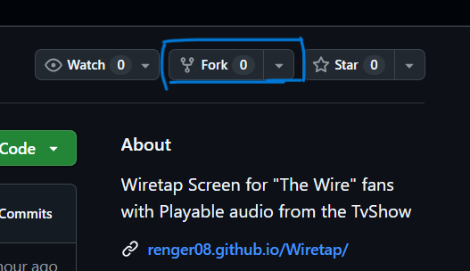
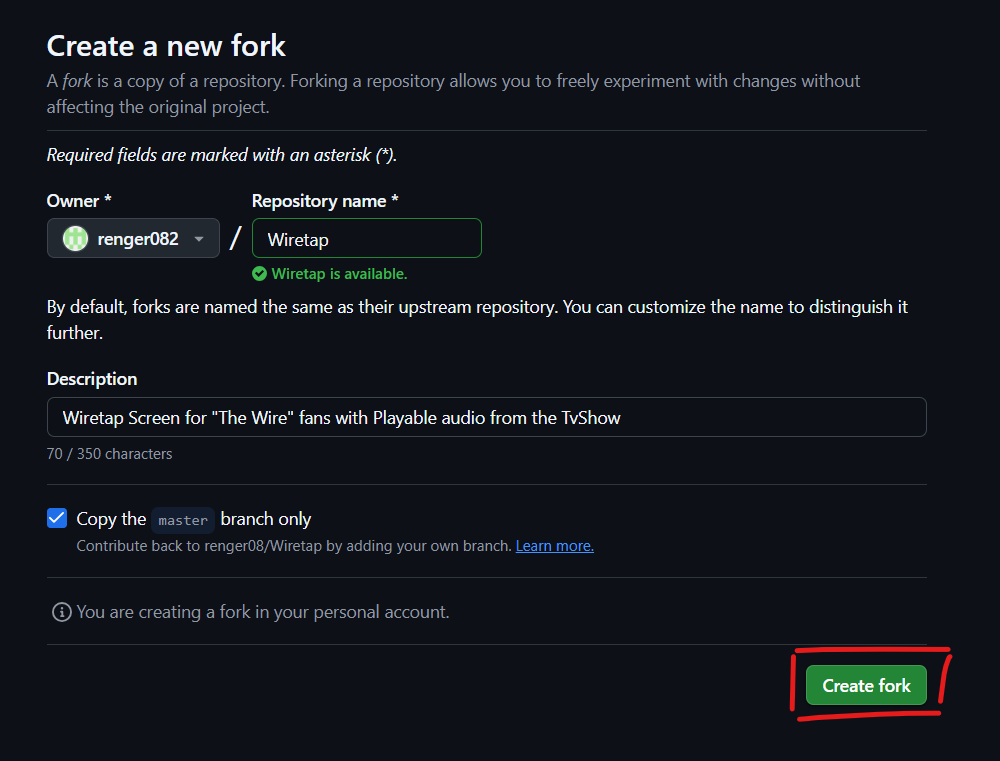

# Wiretap
### Wiretap Screen for "The Wire" fans.

توی این پروژه سعی کردم صفحه کامپیوتر شنود رو که کاراگاه فری‌من و پرز باهاش کار میکردن رو باز سازی یا به اصطلاح رپلیکا کنم.

چون بخاطر تنظیمات امنیتی مرورگر ها نمیشه همین جوری صفحه <code>html</code> رو باز کرد، بخاطر همین میشه از سرور محلی پایتون استفاده کرد (یا از نرم‌افزار هایی از این قبیل. مثل <code>xampp</code>). قبل از هرچیز مطمئن باشید پایتون نصبه. بعد یه ترمینال توی این پوشه که فایل ها داخلش هستن باز کنید و با دستور <code>python -m http.server 8000</code> یک سرور محلی اجرا کنید. بعد وارد مرورگر دلخواه بشید و آدرس <code>localhost:8000</code> رو توی نوار آدرس وارد کنید و دکمه اینتر بزنید. تبریک میگم شما وارد صفحه شنود شدید!

همینطور میتونید این پروژه رو برای خودتون <code>Fork</code> کنید. یا از طریق لینک های زیر وارد این صفحه بشید:

[لینک صفحه در وبسایت شخصی خودم]()
[لینک صفحه در `github pages`]()

برای فورک کردن کافیه از این  قسمت گزینه فورک رو انتخاب کنید:

بعد روی <code>Create Fork</code> کلیک کنید:

<h2>ستاره دادن یادتون نره ✨</h2>
ممنون میشم به این پروژه ستاره 💫 بدید.

