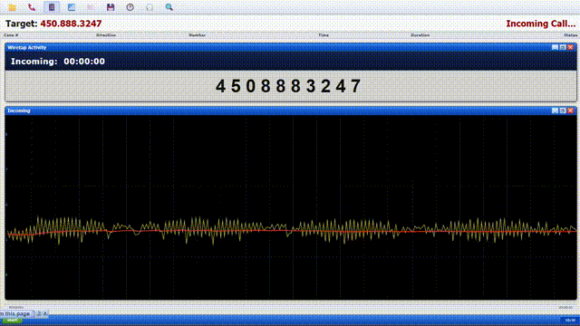

# Wiretap

A browser-based recreation of the surveillance interface from *The Wire*, designed as an ambient experience that can run on its own.

**[▶ Live Demo — Personal Website](https://wiretap.thealinabati.ir/)**
**[▶ Live Demo — GitHub Pages](https://renger08.github.io/Wiretap/)**



## What is Wiretap?

*Wiretap* started as a small Raspberry Pi Zero 2 W project: a monitor, speakers, and a screen inspired by the wiretap computer used by Jimmy McNulty, Lester Freamon, and the detail in *The Wire*.

The idea was simple — turn it on, leave it running, and let it behave like an old surveillance workstation sitting in the corner of a room.

The project later evolved into a browser-based recreation that can run directly on a desktop, laptop, or display.

It is intentionally designed as an **ambient experience rather than an interactive application**.

## How it works

Once started, the interface runs continuously:

```text
STANDBY
   ↓
DIALING
   ↓
RINGING
   ↓
CONNECTED — RECORDING
   ↓
CALL ENDED
   ↓
STANDBY
```

Each cycle selects a recording at random, displays its associated phone number, dials the number digit by digit with DTMF tones, plays the recording, and visualizes the audio through the waveform display.

The same recording is never selected twice in a row.

## Features

* 21 call recordings
* Random call selection
* No immediate repetition of the same call
* Digit-by-digit telephone dialing
* Synthesized DTMF tones
* Synthesized telephone ring
* Real-time audio-reactive waveform
* Frequency spectrum visualization
* CRT-style visual effects
* System clock
* Call duration timer
* Automatic looping
* Responsive scaling for different screen sizes
* Landscape-oriented mobile display
* Designed around a 1366×768 reference display
* Web Audio API processing

## Try it

The easiest way to experience Wiretap is through the live version:

**[Open Wiretap](https://wiretap.thealinabati.ir/)**

There is also a GitHub Pages version:

**[Open on GitHub Pages](https://renger08.github.io/Wiretap/)**

Because browsers restrict automatic audio playback, a normal browser may require a click or other user interaction before audio can start.

## Run locally

Wiretap is a static web project and does not require a backend or build system.

Because browsers can restrict audio and other resources when an HTML file is opened directly with `file://`, serve the project through a local HTTP server instead.

### Python

Make sure Python is installed, then open a terminal in the project directory:

```bash
python -m http.server 8000
```

Open:

```text
http://localhost:8000
```

You can also use another local HTTP server such as XAMPP.

## Project structure

```text
Wiretap/
├── index.html
├── assets/
│   ├── wiretap.gif
│   └── wiretap_v2.gif
├── audio/
│   ├── call1.mp3
│   ├── call2.mp3
│   └── ...
├── css/
│   └── style.css
├── js/
│   ├── audio.js
│   ├── call.js
│   └── script.js
└── .github/
    └── workflows/
        └── deploy.yml
```

### Main components

**`index.html`**
Contains the interface and application layout.

**`css/style.css`**
Controls the visual design, CRT effects, scaling, windows, taskbar, and responsive behavior.

**`js/script.js`**
Handles initialization, screen scaling, clocks, the audio unlock flow, and application startup.

**`js/audio.js`**
Handles the Web Audio API, synthesized tones, DTMF dialing sounds, the telephone ring, and audio analysis.

**`js/call.js`**
Contains the call list, random call selection, dialing sequence, waveform rendering, and main playback loop.

## Technology

Wiretap is built with standard web technologies:

* HTML
* CSS
* JavaScript
* Web Audio API
* Canvas API

No framework or build step is required.

## Disclaimer

Wiretap is an **unofficial fan-made project inspired by the television series *The Wire***.

It is not affiliated with, endorsed by, or associated with HBO, David Simon, or the creators of *The Wire*.

The project is made for fan and educational/experimental purposes.

The included recordings and references to the series belong to their respective copyright holders.

## Credits

Inspired by the surveillance interfaces and atmosphere of *The Wire*.

Special inspiration goes to the wiretap detail and the surveillance workstation used throughout the series.

---

If you enjoyed the project, feel free to explore the code, fork the repository, or adapt the idea for your own display.
